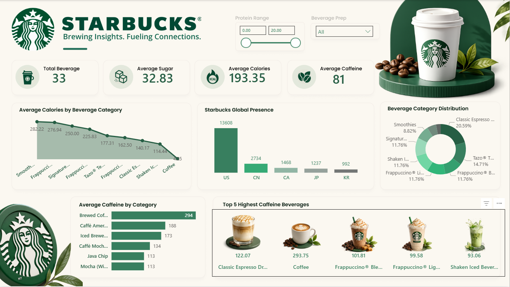

# Starbucks Beverage Analytics Dashboard

## 📊 Project Overview

An interactive Power BI dashboard developed to analyze Starbucks beverage
categories, nutritional metrics, caffeine levels, and global store presence.

The dashboard transforms beverage data into interactive KPIs and
visualizations that allow users to explore beverage characteristics,
category-level performance, and Starbucks presence across different countries.

## 🎯 Objectives

- Analyze beverage category distribution
- Compare average calories across beverage categories
- Analyze average caffeine levels by category
- Explore sugar and calorie metrics
- Analyze Starbucks presence across countries
- Identify beverages with high caffeine levels
- Explore beverage-level characteristics using interactive filters

## 📈 Key Performance Indicators

| Metric | Value |
|---|---:|
| Total Beverages | 33 |
| Average Sugar | 32.83 |
| Average Calories | 193.35 |
| Average Caffeine | 81 |

## 🔍 Dashboard Analysis

### Beverage Analysis

- Beverage category distribution
- Beverage-level analysis
- Top 5 highest caffeine beverages

### Nutritional Analysis

- Average calories by beverage category
- Average caffeine by category
- Average sugar
- Average calories

### Global Presence

- Starbucks presence by country
- Comparison of store presence across countries

## 🎛️ Interactive Filters

The dashboard includes filters for:

- Protein Range
- Beverage Preparation

## 🛠️ Tools & Technologies

- Power BI
- Data Analysis
- Data Visualization
- Business Intelligence

## 📷 Dashboard Preview

The dashboard provides an interactive view of beverage characteristics,
nutritional metrics, caffeine levels, and global Starbucks presence.

## 📂 Project Files

- `dashboard/Starbucks.pbix` — Power BI dashboard
- `images/starbucks-dashboard.png` — Dashboard preview

## 📌 Skills Demonstrated

- Data Analysis
- Data Visualization
- Dashboard Development
- KPI Analysis
- Business Intelligence
- Interactive Reporting
- Category Analysis

## 👤 Author

**Vipan Kumar**

B.Tech — Computer Science & Engineering (Artificial Intelligence)

Focused on Data Analytics, Power BI, SQL, Excel, and Python.
